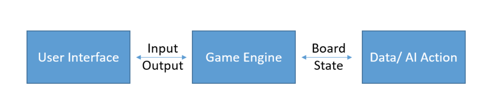

# MS1: Stratego Design Document

Jonathan Bai jb969, Kanu Jason Kanu kjk225, Gabriel Ngam gn93

# System Description

The game of Stratego will have two main parts to it: the creation of the initial board state and the actual gameplay. First, there will be a main menu, where you go immediately to the board state creation phase. After the board is created and you confirm you want to proceed, you reach the actual state of the game. From here, you will be playing against an AI, where the AI reacts smoothly based on what you have done. Pieces are moved in the game interactively through the GUI, and once you attack a piece, the piece of that AI is displayed to you for the rest of the game. The game will complete when either the player or the AI obtains the flag, at which point you can choose to close the game or go to the main menu. To clarify the rules, we will be implementing the original Stratego rules given [here](https://www.fgbradleys.com/rules/Stratego.pdf).

# Architecture




As a game of stratego that does not involve online access, our C&C diagram is relatively simple and involves the user interface and inputs moving properly with the game engine and provided data.

# Data

Stratego is a turn-based board game with no outside information held by the players. Therefore, the only data we have to hold relates to the state of the board, which is a 10x10 grid. We might also want to store additional data, such as the current turn, the number of taken pieces, and so on, so we will represent our board as this record: 

```ocaml
type board = {
    board_state:square list list;
    turn:int;
    player_to_move:player
}
```


Each square is either occupied by a certain player’s piece, is a lake, or is empty. Lakes are uninhabitable by pieces, so they are categorized differently to make movement easier. We represent each square with a variant. If a piece is occupied by some player, there is also a boolean parameter that determines the visibility of a piece. If an opposing piece succeeds in battling a player, the piece is made visible. Initially, all opposing pieces are hidden.

```ocaml
type square = 
    | Lake
    | Empty
    | Occupied of piece * player * bool


type player = 
    | Red 
    | Blue
```

A piece is owned by the red or the blue player. There are 11 types of pieces: 9 soldiers with powers from from 1-9, a bomb, and a flag. One unique ability is that scouts with power 1 can move like rooks in chess, but combat is also based on the power of the soldier, so we decided to represent combat easier through integers with special casing movement for soldiers as the tradeoff. Pieces are represented as follows: 

```ocaml
type piece = 
    | Soldier of int
    | Flag
    | Spy
    | Bomb
```

This is all the internal state that is required for Stratego. 


# System Design

Our implementation of Stratego will have four main states: the "main menu", the state where you are adding your pieces to the board, the state where you are playing the game against the AI, and the state where you are at the end of the game, and you are choosing between either exiting the game or restarting the game. We will have a main method that checks what state we are currently in, prompts the user for some sort of input, and then transitions to the next state or stays in the same state. All verbs in the diagram below are abstracted into modules.


For the first state, the command line interface prompts the user to go to the board building phase. This only consists of parsing command line input, so we do not extract this into modules.

The next state is the board building phase. At this phase, you are have four options: ask for help on how to do something, remove a piece that you have placed on the board, add a piece to the board, or finalize your board state. Each of these options can fail or succeed depending on the board's current state, and the finalize function transitions the board to the gameplay phase. 

We need something that displays a board. To let it display, say, on a command line or a gui, we will use the following interface: 

```ocaml
module type BoardViewer = sig
    val display_board : board -> unit
end
```

Next, the builder actions are all in the same state, so we will create a module interface with the following functions. A type `t` is used instead of a `board` because we want to easily track the number of pieces we have left to place.: 

```ocaml
module type BoardBuilder = sig
    type t
    val add: board -> placement -> (board * add_msg)
    val remove : board -> placement -> (board * rem_msg)
    val help : message
    val finish : t -> board
    val make : t
end
```

Our CLI will transition to the gameplay state if and only if the build_msg is appropriate. 

For the third state, we are in our actual gameplay. We input a move, at which point we succeed, display the result, do the AI move, and then prompt the user again. Depending on our or the AI's move, a victory might result, which takes us to the final state, the exit menu. The move function should take the board, an argument, and a command, and the AI should be able to take the current state of the board and output the new state of the board after having moved. Because we might want to have several AI's, we will make the AI moves a module and the game moves another module. Both the player and the AI make moves, but they might also rely on knowing whether a given move is valid or extracting the set of valid moves, so we expose them in a separate Game module. 


```ocaml
module type Game = sig
    val is_valid: board -> move -> bool
    val valid_moves: board -> move list
end

module type Player = sig  
    val move: board -> move -> (board * player_move_msg)
end

module type AI = sig
    val move: board -> (board * ai_move_msg)
end
```

Lastly, we have our final state, which just prompts the user to go back to the original state. This doesn't do anything fancy, so it is not abstracted out of 

Modules for this game mutate the board state, and along with them a message is passed. The main method determines what the new overarching state of the game should be based on 

# Module Design

See the module interface files for documentation. 

# External Dependencies

## Yojson

Used in boardbuilder for the creation of Ai boards.

## Lablgtk2

We are making a GUI, and used Lablgtk2 to do so. The state of the GUI is updated asynchronously based in the incrementing of a counter.
However, we had issues in implementing the link between the GUI and the main method

# Testing

## Overview

Our testing involved a series of unit testing involving multiple board states. As our project revolves around each module and function altering the state of the overall board, we can create the a start state with a function and the intended end state. The tests will check if each function reaches the appropriate end state in addition to having the appropriate message associated with it. 

## BoardViewer 

`display_board` will be manually tested for bugs and glitches in the system through various test playthroughs to make sure the display of the command line and GUI is working properly. 


## BoardBuilder 

`add` and `remove` can be tested by manual testing through the game. Unit tests are difficult to write in this case. `add` will be tested by attempting to add each types of pieces onto a lake, an empty square, and an occupied block. `remove` will be tested in a similar manner. Essentially, the tests will check if the correct board state is outputted after each function. Build will be tested both manually and automatically through the tests of build_msg outputs in addition to manual tests for the visual appearances of the board. 

## Game 

We tested the set of valid moves for some pieces via unit tests for `valid_moves` on, say, a scout that is able to move multiple squares at once. For the most part, we were able to test the game by playing through it on the command line version of the game. We temporarily allowed us to view the pieces of the opposing player instead of hiding them, which allowed us to verify the outcomes of certain battles in a manner that is much easier than the slower unit tests. For the most part, the code is mostly correct just from proofreading the pattern matches on combat or movement, so unit tests were for sanity checking. 

## Player and Module AI 

AI moves were always a subset of the moves made available through `valid_moves`, so testing `valid_moves` was sufficient for testing `ai_moves`. We did not unit test the behavior of the AI, and instead tested it based on actually playing the game with full vision. From this sort of testing, we were able to spot some strange issues with the AI, such as it moving the same pieces back and forth or moving one piece forward and the piece behind it backward and forward repeatedly. 

## Known Bugs

Currently, commandline viewer is fully functional, however we could not find the link between the almost completed GUI and the game main files.

## Division of Labor

Jonathan Bai

Implemented AI, initial boardbuilder, and the test cases on valid_moves neccessary to keep AI and the game running. Helped on general game creation and testing. Spent approximently 40 hours in drafting and coding the possible AI movements and filters. Worked to smooth out our design.

Gabriel Ngam

Implemented Game, Player, a version of BoardBuilder that contained arrays, Main, and Cmdlineboardviewer. Tested the the commmand line version of the game via `make play`. Spent an undefined(30?) number of hours on design and implementation.  

Kanu Jason Kanu

Implemented Gui function. Gui works as a separate file but does not connect with the main function. You can see the images in the gui folder to see what some of the main boards would have looked like. Buttons and event boxes do work. I spent appx. 40 hours on the project. 
